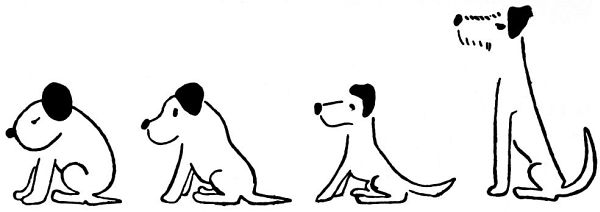
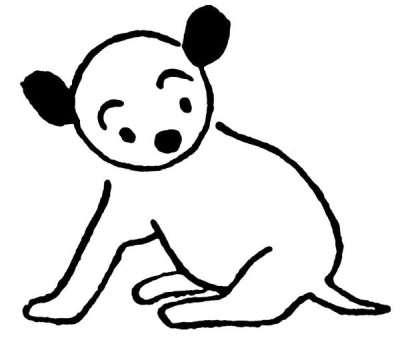
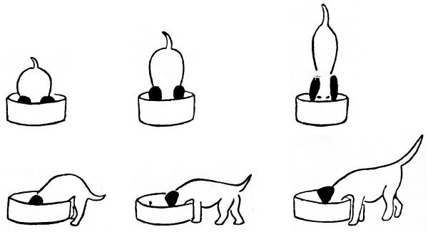
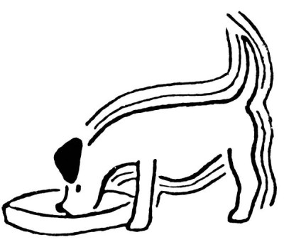

Jak vidíte, děti, dá to hodně práce, a hlas přírody, jemine, to je vám přísný učitel, nic takovému štěněti nesleví. Jenže někdy nemá kdy napovídat, protože musí učit lítat mladého vrabce nebo ukázat housence, které listy žrát a kterých nechat. Tehdy uloží Dášeňce jenom domácí úkol (například přejít v úhlopříčně celou psí boudu z rohu do rohu) a nechá ji, aby se s tím, chudera malá, dřela sama. Dášeňka dává pozor, až jazejček samou pozorností vyplazuje: pravá přední – teď levá zadní (jezusmankote, která vlastně je levá, ta nebo ta?) – a druhá zadní (kdepak já ji mám?) – a co teď? „Špatně,“ volá na ni hlas přírody, celý udýchaný, jak učí vrabce lítat, „musíš dělat menší kroky, Dášeňko, a hlavu nahoru a tlapky pěkně pod sebe znovu!“ Copak hlas přírody, tomu se to káže; ale když jsou ty nožičky měkké jako z nití a třesou se jako z rosolu, dělejte s nimi něco! A když máme takový plný bříšek a takovou velikou hlavu, myslíte, že to je malá práce? Dášeňka si sedne zdrceně uprostřed boudy a fňuká. A tu je máma Iris, těší psí holčičku a dá jí napít; pak obě usnou, ale Dášeňka se hned probouzí, vzpomněla si, že nedodělala domácí úkol, a drápe se rovnou přes mámin hřbet do toho druhého rohu psí boudy. „Dobře, Dášeňko,“ chválí ji hlas přírody, „budeš-li se takhle pilně učit, bude z tebe pejsek rychlý jako vítr.“

  

Další pokroky

  

Učí se sedět (pohled ze strany)

  

Učí se sedět (pohled odpředu)

To byste nevěřili, co má takové štěně práce: když se neučí chodit, spí; když nespí, učí se sedět (a to není jen tak, pánové: to zase hlas přírody hartusí: „Seď rovně, Dášeňko, hlavu nahoru a neohýbej tak záda; pozor, sedíš si na hřbetě, teď zase si sedíš na nožičkách, a kde máš ocásek? Na ocásku si také nesmíš sedět, protože bys jím nemohla vrtět,“ a tak dále – samé napomínání).

  

Ztratila nohu

  

Učí se žrát (celkový pohled)

A i když štěně spí nebo pije, má přitom za úkol, že musí růst; každý den mají být nohy o něco delší a silnější a krk o něco vytáhlejší a čumáček o něco zvědavější – to víte, když mají růst všechny čtyři nohy najednou, dá to hromadu práce. A na ocásek nezapomenout, aby rostl a sílil a nezůstal takový myší; foxteriéři přec mají mít oháňku silnou jako klacík a švihat jí, až to sviští. A musí se umět stříhat ušima, hýbat ocáskem, hlasitě kvičet a kdesi cosi. Tomu všemu se musí Dášeňka učit. Už umí chodit po nožičkách; pravda, někdy některou nohu ztratí, neví, kde ji má, a musí si sednout, aby ji zase našla a dopočítala se všech čtyř; pravda, někdy se svalí, ale na to už je zařízena celá jako váleček, jen se kutálet. Ale život štěněte je ukrutně složitý: teď zase mu rostou zuby.

Nejdřív byly jako krupičky, ale nyčko nějak rostou do špiček; čím jsou špičatější, tím mocněji propuká v Dášeňce potřeba zaměstnávat se kousáním. Naštěstí jsou na světě věci neobyčejně vhodné ke kousání, například máminy uši nebo lidské prsty; vzácněji se Dášeňce naskytne špička lidského nosu nebo boltec člověčího ucha – dostane-li se k nim, hryže je s náruživým rozkošnictvím. Nejhůř je na tom matka Iris: má břicho do krve rozkousané Dášeňčinými zuby a rozdrásané jejími drápky; kojí věrně tu malou surovkyni (surovečku, surovnici, surovčici, surovinku – safra, jak by se mělo říkat holčičce od surovce?), ale přitom bolestí mrká. Nic platno, Dášeňko, s mateřskou stravou už bude konec; musíš se začít učit ještě jednomu umění: žrát z misky.

Pojď sem, malá, tady máš misku s mlíčkem. Cože, ty nevíš, co se s tím dělá? Inu, strčí se k tomu čumáček, vyplázne se jazyk, namočí se v tom bílém a honem se zasune zpátky, aby na něm zůstala kapka toho bílého; a to se dělá znovu, bis, repete a da capo[\[1\]](./resources/undefined), až je miska prázdná. Nedívej se tak hloupě, Dášeňko, nic na tom není; nu tak, dej se do toho, alou!

Dášeňka nic, jen poulí oči a třese ocáskem.

Ech, ty hloupá, když to nejde jinak, musím ti do mlíčka strčit tvůj nechápavý nos, chtěj nebo nechtěj: tak! – Dášeňka je zdrcena násilím, které se na ní stalo; má čumáček a vousy smočené v mléce, musí se olíznout jazejčkem, a namoutě kutě, ono je to dobré. A teď už ji nic nezdrží: leze sama za tím dobrým bílým, hrne se hlavou a tlapkami do misky, rozlévá mléko po zemi a rousá si v něm všechny čtyři, ba i uši a ocásek; musí přijít máma a olízat ji, ale začátek je učiněn; za pár dní bude už Dášeňka vylizovat misku, jako když bičem mrská, a přitom vůčihledě poroste jako z vody, ba co dím, jako z mléka. Tož si z ní, děti, vemte příklad a pilně jezte, abyste rostly a sílily na duchu i na těle, tak jako to znamenité štěně, jemuž se dostalo jména Dášeňka.

  

Roste jako z vody
