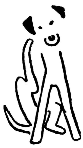

<section>

</section>

[^1]: Bis, repete a da capo (ital.) – v hudebním názvosloví dvakrát, opakuj od začátku. _Pozn. red._

[^2]: Infighting (angl.) – boj zblízka (např. v boxu). _Pozn. red._

[^3]: Gagát – tmavý minerál, drahý kámen; dříve zaměňovaný s jantarem. _Pozn. red._
