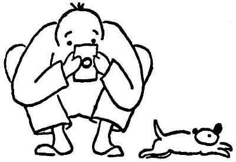

<section>

Řeknu to rovnou: špatně; a vyžaduje to krajní trpělivosti od štěněte i od fotografa.

Dejme tomu, slunce zasvítí na dojemnou scénu štěněte žeroucího z misky. Člověk se tryskem řítí pro fotografický aparát, aby zvěčnil tento působivý výjev ze života štěněte. Nežli se vrátí s aparátem, je miska ovšem prázdná. „Honem, nalejte Dášeňce ještě jednu misku mlíčka,“ káže fotograf a s náležitou odbornou rychlostí nařídí expozici a zaostří objektiv, zatímco se Dášeňka hrdinně dává do druhé misky. „Tak, teď je to pěkné,“ vydechne fotograf, a v tu chvíli zjistí, že zapomněl dát do aparátu film. Než jej tam vloží, sežere Dášeňka druhou misku mléka. „Dejte jí ještě jednou,“ káže fotografující člověk a honem zaostřuje. Jenže Dášeňka si vezme do hlavy, že už nebude a nebude žrát. A že prý ne. Marné jí domlouvat. Marné jí strkat nosánek do mléka. Nechce, a basta. S povzdechem odnáší fotograf svůj aparát domů; a Dášeňka, vědoma si svého vítězství, jde nyní spořádat třetí porci mlíčka.

Dobrá, podruhé už je člověk lépe připraven a má nabitý aparát po ruce. Sláva, teď si Dášeňka ve svém rejdění na chvilku sedla; teď honem zaostřit, – a v ten okamžik, kdy stiskneš spoušť, štěně sebou mrskne a je totam. Pokaždé sebou mrskne, když cvakne spoušť, a odletí rychlostí jednoho metru za setinu vteřiny.

  

Tak takhle to nejde, musí se na to jinak. Zatímco fotograf zaostřuje, postaví se dva bližní k Dášeňce a povídají jí pohádky, aby vydržela hačat. Ale Dášeňka nemá zrovna chuť na pohádky, nýbrž chce honit mámu. Nebo jí je horko na sluníčku a začne fňukat. Nebo v rozhodném okamžiku hodí hlavou s takovou rychlostí, že se na desce místo bílého štěněte ukáže bílá čmouha. Když takto zkazila desku, uklidní se Dášeňka a sedí jako pecka.

Zkusili jsme ji přinutit mírným výpraskem, aby pět vteřin poseděla: vzpouzela se jako posedlá. Podpláceli jsme ji kousíčkem masa: slupla je a hrnula se za dalším soustem s takovou čilostí, že to zas nešlo. Ono to vůbec nešlo. Pánové, spíš se dá fotografovat pád do propasti nebo blesk na nebi než život štěněte. Říkám vám to proto, abyste dovedli ocenit těch několik obrázků, které se podivuhodnou náhodou nepokazily. Bylo k tomu třeba takového štístka jako k tomu, aby člověk našel v uhláku diamant jako pěst. Já jsem takový diamant sic nenašel, ale musí to být příjemné překvapení.

Na té fotografické páračce je nejzajímavější, když se takové štěně vyvíjí (myslím v černé komoře ve vývojce). To nejdříve vyleze černý čumáček, pak se zalesknou černé oči, načež se ukážou černé slechy; ale nos, jak se na pejska sluší, vykoukne z obrázku první.

  

Zkrátka, máte-li fotografický aparát, pořiďte si k němu štěně; máte-li štěně, pořiďte si k němu fotografický aparát, a pak zkuste své štěstí. Je to napínavé, napínavější než lov na plachou zebru nebo tygra bengálského. A více vám už o tom neřeknu: přesvědčte se sami.

</section>
