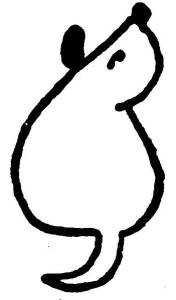

## Pohádka o psím ocásku

Tak poslouchej, Dášo, když budeš chvilinku pěkně sedět, povím ti pohádku. O čem pohádku? No, třeba pohádku o psím ocásku.

Tak jednou byl jeden pejsek, Foxlík se jmenoval. Víš, jak vypadal? Celý bílý byl a měl jenom černá ušiska, a oči černé jako gagát[\[3\]](../Text/dasenka_cili_zivot_stenete_057.html#_ftn3), a čumáček černý jako antracit; a jako znak, že je pravý a čistokrevný teriér, měl v puse na patře černou skvrnu, jako ty ji máš. Vidíš, ty o ní ani nevíš; jednou ti ji ukážu v zrcadle, až budeš na celé kolo zívat. A ocásek ti měl takhle dlouhý, skoro tak dlouhý, jako byl jeho vlastní rodokmen, a tím ocáskem dovedl švihat, že jím mohl tulipány stínat. To neměl dělat, Dášeňko, ale takovou měl sílu v ocásku.

Ten pejsek Foxlík byl veliký hrdina a nikoho se nebál. Hodné lidi nekousal a návštěvy taky ne, to se totiž nemá dělat, ale když slyšel o někom nedobrém, třeba o loupežníkovi, tak na něho šel a zadávil ho: chytil ho jednoduše za krk a zatřepal jím, až bylo po něm. Jednou slyšel, že v horách žije v takové skalní boudičce čili jeskyni přeukrutný drak. Víš, co je to drak? To je takový zlý a nepěkný sedmihlavý pes, který požírá zvířata i lidi, ba i pejsky, jen si to považ; představ si, co toho takový drak sežere, když má sedm hlav. A na toho strašného draka se Foxlík vypravil, že ho jako zadáví. A co myslíš, zadávil ho? To se rozumí, že zadávil; skočil mu na ucho, jako ty to děláš mamince, a drak naříkal a utekl. Takový byl ten Foxlík hrdina.

  

Podruhé se vypravil, aby zadávil obávaného obra, který bydlel až tamhle někde na Pankráci. Ten obr byl pověstný lidojed a pejskožrout a slyšel na hrozné jméno Antoušek. Foxlík se ho nebál, protože měl na krku psí známku (to je takový čarovný amulet, co dodává pejskům ohromnou sílu, – proto každý řádný pes nosí psí známku). A co bys řekla, zadávil ho? Zadávil. Skočil mu na nohy a roztrhl mu nohavici; a když ten obr Antoušek viděl, že Foxlík má na krku čarovnou psí známku, zaklel tak hrozně, že to až sírou zasmrádlo, a utekl. To máš radost, viď?

A do třetice všeho dobrého se ten udatný Foxlík vypravil proti samotnému přeukrutnému tatarskému chánovi, který se jmenoval Pelichán a bydlel tamhle ve Strašnicích. Nejdřív na toho Tatara statečně zaštěkal. Chán Pelichán se lekl, až mu srdce spadlo do kalhot, a třásl se tak, že nemohl ani své brejle najít. A protože neměl brejle, viděl špatně, a jak ten Foxlík neohroženě mával ocáskem, myslel si, že to mává nějakou šavlí či palašem. I popadl svůj vražedný meč a počal jím šermovat proti Foxlíkovu ocásku, a také mu ho, nešlechetník jeden, špičku usekl. Foxlík, to se rozumí, se dožral, nechal ocásek ocáskem, naježil srst a zakousl se Tatarovi do kalhot. Ale protože tomu Tatařínovi spadlo srdce do kalhot, prokousl hrdina Foxlík srdce chána Pelichána, a ten na místě padl mrtev a víckrát se v kraji neukázal.

Na věčnou paměť toho slavného vítězství nad krvežíznivým Tatarem si všichni přímí a čistokrevní potomci rekovného Foxlíka, takzvaní hrubosrstí foxteriéři, dávají useknout špičku ocásku. Také ty, Dášeňko, si ji dáš useknout, až přijde čas. Pravdaže to trochu bolí, ale musí se to provést šikovně.

Tak, a už to je. Děkuju za posezení.

