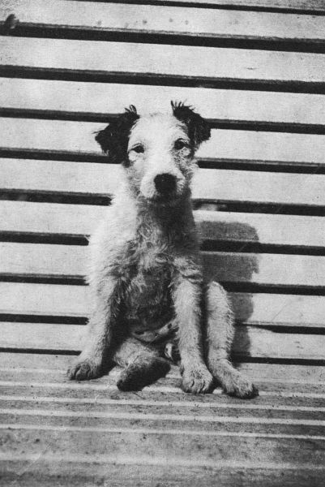
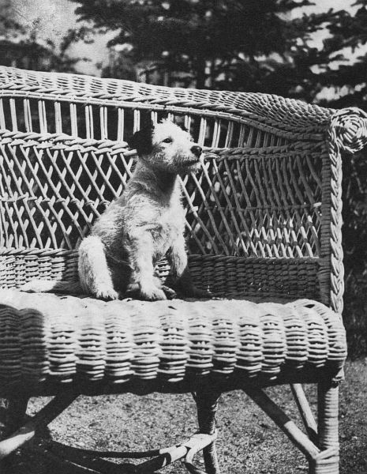

<section>

</section>

<section>

  

Ze začátku se to vešlo do dlaně

</section>

<section>

  

Z prvních dnů života

</section>

<section>

  

Rodinný život

</section>

<section>

  

Kterak Dášeňka rostla

</section>

<section>

  

Ticho, Dášeňka spí!

</section>

<section>

  

Na výzkumné cestě

</section>

<section>

  

Štěně v krabici

</section>

<section>

  

Krmení

</section>

<section>

  

Hraje si s kolíčky

</section>

<section>

  

„Uzvednu se, nebo ne?“

</section>

<section>

  

Necháš ty sandály!

</section>

<section>

  

V košíku

</section>

<section>

  

Kouše maminku

</section>

<section>

  

Zátiší zahradnické

</section>

<section>

  

Zátiší vědecké

</section>

<section>

  

Pozor, zlý pes!

</section>

<section>

  

Vyplazuje jazyk na celý svět

</section>

<section>

  

V zamyšlení

</section>

<section>

  

Zívnutí čili dlouhá chvíle

</section>

<section>

  

Dášeňka na talíři

</section>

<section>

  

Odpočinek

</section>

<section>

  

„Dášeňko!“ – „Co?“

</section>

<section>

  

Na číhané

</section>

<section>

  

Co teď?

</section>

<section>

  

Dravé zvíře za mříží

</section>

<section>

  

V přírodě

</section>

<section>

  

Leknín

</section>

<section>

  

Kropicí konve

</section>

<section>

  

Ve společnosti

</section>

<section>

  

S maminkou

</section>

<section>

  

Slečna Dáša

</section>