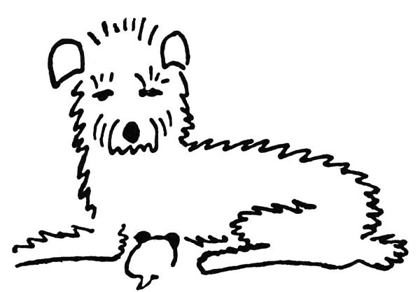

Když se to narodilo, bylo to jenom takové bílé nic, do hrsti se to vešlo; ale anžto to mělo pár černých ušisek a vzadu ocásek, uznali jsme, že to je psisko, a protože jsme si přáli mít psí holčičku, dali jsme tomu jméno Dášeňka.

  

Dášeňka se narodila

Dokud to bylo bílé nic, bylo to slepé, bez očí, a co se nožiček týče, inu, mělo to dva páry čehosi, čemu se při dobré vůli mohlo říkat nožičky. Ale protože tu ta dobrá vůle byla, byly tu i nožičky, třebaže ještě za mnoho nestály; kdepak, stát se na nich nedalo, takové byly vratké a slaboučké, a s chůzí to byla, holenku, teprve potíž. Když se do toho Dášeňka pořádně obula (totiž ona se neobula, ale vykasala si na to rukávy) (přesněji řečeno, ani rukávy si nevykasala, ale jenom si, jak se říká, plivla do dlaní) (rozumějte mi, ona si ovšem nemohla plivnout do dlaní, protože ještě plivat neuměla a dlaně měla tak maličké, že by si do nich netrefila), zkrátka když se do toho Dášeňka pořádně dala, dokutálela se za půl dne od máminy zadní nohy k mámině noze přední, přičemž se cestou třikrát nakrmila a dvakrát vyspala. Spát a jíst uměla totiž hned od narození, tomu se učit nemusela; proto to dělala horlivě po celý boží den, a myslím, že i v noci, když se na ni nikdo nedíval, spala stejně svědomitě jako ve dne – takové to bylo pilné štěně.

  

Druhý den

Krom toho uměla pištět; ale jak štěně piští, to nakreslit nedovedu a ukázat bych vám to také nemohl, protože na to nemám dost tenký hlas. I mlaskat uměla Dášeňka od narození, když sála mámino mlíčko, ale víc už nic; jak vidíte, nebylo s ní zprvu mnoho řeči, ale její mamince (jmenuje se Iris a je hrubosrstá foxteriérka) to stačilo: celý den si měla se svým nunátkem Dášeňkou co povídat a šuškat, očichávala ji, líbala a lízala, čistila a jazejčkem umývala, česala a hladila, pěstovala ji, krmila ji, laskala ji, hlídala ji, své vlastní huňaté tělíčko jí podestýlala za polštář, a to se to, panečku, Dášeňce spalo! Abyste věděli, tomu se říká láska mateřská a u lidských maminek je to taky tak, však vy víte. Jenže lidské maminky dobře vědí, co a proč dělají; ale taková psí maminka to neví, jenom cítí, že jí to příroda káže. „Haló, psí paničky,“ káže hlas přírody, „pozor, pokud to vaše maličké je slepé a nanicovaté, pokud se to neumí samo bránit, ba ani se schovat nebo volat o pomoc, nesmíte se od toho ani hnout, to vám povídám; musíte hlídat, svým tělem je krýt, a kdyby se blížil někdo podezřelý, tedy hrr na něj a zadavte ho!“

  

Třetí den

Iris to vše brala strašně doopravdy, a když se přiblížil jeden podezřelý advokát, běžela ho zadávit a roztrhla mu nohavici; a když se blížil jeden spisovatel (však to byl Josef Kopta), chtěla ho také zadávit a kousla ho do nohy, a jedné ženské osobě roztrhala celé šaty, ba vrhala se útočně i na úřední osoby, jako je listonoš, popelář, elektrikář a ten pán od plynu. Krom toho ohrožovala množství veřejně činných osob, sápala se na jednoho poslance, měla jakési nedorozumění i se strážníkem, a dík své ostražitosti a bojovnosti uchránila svého jedináčka od všech úkladů, nepřátel a zloby světa. Taková psí maminka, pánové, nemá snadný život: lidí je mnoho a všechny pokousat nemůže.

  

První oko

  

Učí se chodit

Toho dne, kdy Dášeňka slavila desítidenní výročí svého života, potkala ji první veliká událost: když se ráno probudila, shledala k svému úžasu, že vidí – zatím jen na jedno oko, ale ono i jedno oko je, abych tak řekl, veliký krok do světa. Byla tím tak překvapena, že vykvikla, a toto památné kviknutí bylo počátkem psí řeči, která se jmenuje štěkání. Dnes už Dášeňka umí nejenom mluvit, nýbrž i nadávat a pouštět hrůzu; ale tehdy to jen tak vyjeklo, jak když nůž sjede po talíři.

Hlavní ovšem bylo to nové oko; do té doby musela Dášeňka hledat jen čumáčkem, kde má maminka ty dobré knoflíky, co z nich prýští mlíčko; a když se pokoušela lézt, musela před sebou strkat svůj černý a lesklý nos, aby nahmatala, co je před ní. Ba, lidi, takové oko, i když je jen jedno, je znamenitý vynález: jen mrkneš, a víš, ouha, tady je stěna, tuto jakási propast, a to bílé je máma. A když chceš spát, očičko se zaklopí, a dobrou noc, mějte mě rádi. A co abychom se zase probudili? Otvírá se jedno oko, a vida, otvírá se i druhé, mžourá trochu, a už se vykulí celé; a Dášeňka se od té chvíle dívá na svět dvěma očima a spí na dvě oči, takže už nemusí vyspávat tak dlouho a může víc času věnovat tomu, aby se naučila sedět a chodit a ledacos jiného důležitého pro život. Inu, je to pokrok.

  

Dášeňka spí

  

Už vidí

Neboť v tu chvíli se ozval opět hlas přírody a kázal: „Ty, Dášeňko, když už máš kukadla, dívej se před sebe a zkus chodit.“ Dášeňka tedy pohnula ouškem, že jako slyší a rozumí, a zkusila chodit. Nejdřív vysunula pravou přední nožičku dopředu, a co teď? „Teď dej dopředu levou zadní,“ napovídal jí hlas přírody. Sláva, povedlo se to. „A teď tu druhou zadní,“ radil hlas přírody, „zadní, povídám, zadní, ne přední! I ty hloupá Dášeňko, vždyťs nechala ještě jednu nožičku vzadu! Počkej, nemůžeš jít dál, pokud si ji nepřitáhneš; povídám, tu pravou zadní si zastrč pod zadeček! Ne, to není nožička, to je ocásek, ocáskem se nedá chodit. To si pamatuj, Dášeňko, o ocásek se nemusíš starat, ten jde sám za nožičkami. Tak co, máš všechny tlapky pohromadě? No sláva, a teď znovu: vysunout pravou přední, hlavu trochu výš, aby tam bylo místo pro nožičky, tak, dobře, teď levou zadní, a teď pravou zadní (ale ne tak daleko od těla, Dášeňko, pod sebe ji musíš dát, pod sebe, aby se ti bříško po zemi neplouhalo), tak, a teď levou přední, výborně, tak vidíš, jak to jde. Teď si chvilku odpočiň, a zase znovu: jedna – dvě – tři – čtyři, hlavu nahoru, jedna – dvě – tři – čtyři.“

  

Dívá se na svět

  

U maminky
