<section>

Mnoho vody uteklo a zejména mnoho loužiček bylo vyceděno. Dášeňka už není bezmocný uzlíček s třesoucím se ocáskem, nýbrž náramně samostatný, chlupatý a všetečný, zubatý a neposedný, žravý a ničivý tvor. Přírodopisně řečeno, vyvinul se z ní obratlovec (neboť se vrtí jako na obrtlíku) z čeládky šelem šelmovských a psovitých, podčeleď neposedů, rod šmejdilů, rodina tatrmanů, odrůda tajtrlíků černouchých. Jde si, kam se jí zlíbí; celý dům, celá zahrada, celý vesmír, až kam plot sahá, jsou jejím majetkem. V tomto vesmíru je plno věcí, které je nutno vyzkoušet co do jejich kousatelnosti a případně sežratelnosti; je tu plno tajemných místností, ve kterých lze provádět zajímavé pokusy, kde se nejlíp dělají loužičky. (Dášeňka se rozhodla pro mou pracovnu a její okolí, ale někdy dává přednost jídelně.) Dále je třeba zjišťovat, na čem se nejlíp spí (zvláště na utěrkách, v člověčí náruči, uprostřed kvetoucího záhonu, na smetáku, na čerstvě vyžehleném prádle, v koši, v nákupní tašce, na kozí kůži, na střevících, v pařeništi, na lopatce se smetím, na rohoži, ba i na zemi). Jsou předměty, které slouží zábavě, například schody, z nichž se lze úspěšně střemhlav skutálet (to je vám psina, myslí si Dášeňka, padajíc po hubě ze schodů); jsou předměty nebezpečné a nevypočitatelné, jako třeba dveře, které ducnou do hlavy nebo skřípnou tlapku či ocásek, když se toho nejmíň nadáte. V takovém případě Dášeňka zakvílí, jako by ji na nože bral, a ještě chvíli štká v konejšivé lidské náruči; pak dostane pro útěchu slupnout něco dobrého a jde si zase spadnout ze schodů.

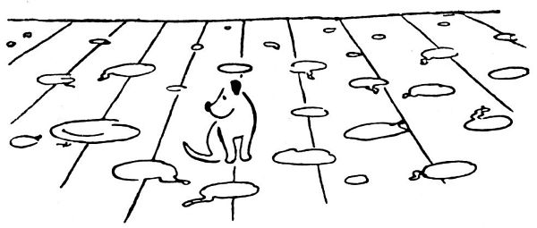  

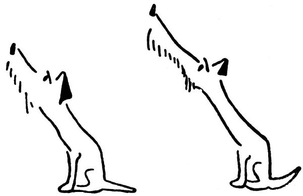  

Větří

Přes některé špatné zkušenosti je Dášeňka přesvědčena, že se jí nemůže nic stát a že se nad její psí hlavou nevznáší žádné nebezpečí. Neuhne smetáku a s důvěrou čeká, že smeták uhne jí; obyčejně to smeták udělá. Vůbec Dášeňka má příbuzenskou náklonnost ke všemu chlupatému, ať je to smeták, nebo žíně (které rve z pohovek), nebo vlasy lidí, s kterými přichází do bližšího styku. Nevyhne se žádné lidské botě; to je věc člověka, aby se vyhnul štěněti, no ne?

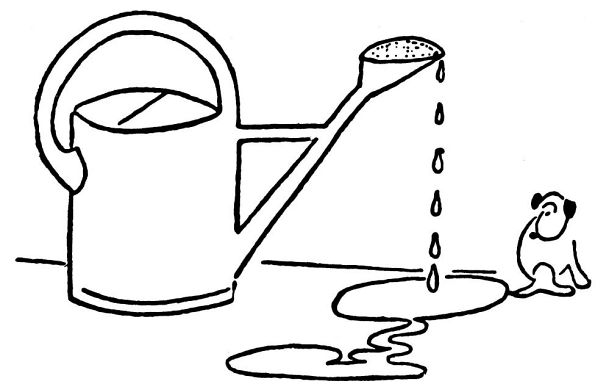  

Loužička

  

Důvěra

Všichni, kdo žijí v domě, jsou nuceni dílem se vznášet, dílem klást nohy opatrně jako na tenkém ledu; člověk nikdy neví, kdy mu to zoufale zakvičí pod botou. To byste, pánové, nevěřili, jak je takového štěněte všude plno. V ničem Dášeňka nepočítá se zlou vůlí a různými úklady a nástrahami tohoto světa; třikrát skočila po hlavě do vodní nádrže v zahrádce, protože jí prostě nešlo na rozum, že by ve vesmíru bylo něco, po čem se nedá báječně běhat. Načež byla teple zabalena a dostala pro útěchu špičku člověčího nosu, aby se z toho leku zotavila kousáním toho nejlepšího, co vůbec je.

  

Špatné zkušenosti

  

Dášeňka usíná

  

Dášeňka se probouzí

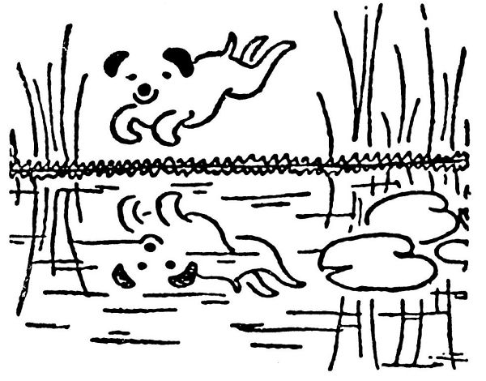  

Pozor, voda!

  

Běh o závod

### Kapitola 4

Ale abychom to brali po pořádku, tedy 1. hlavní, co má Dášeňka na práci, je _běhat_. Teď už to, panečku, nejsou ty namáhavé a potácivé první kroky, nýbrž sportovní výkony vyššího stupně, jako běh, cval, trysk, skok daleký, skok vysoký, let, hon, kalup, pelášení, sprint, spurt na deset yardů, dále různé pády, jako pád nosmo, hřbetmo, pád na hlavu, kotrmelec v běhu s jedním nebo více přemety, rozběhy s překážkami, běh s handicapem (například s utěrkou v hubě), různé způsoby kutálení, překocení, svalení, přemetů, veletočů a dopadů, útok, útěk, odskok a úprk, zkrátka všechno, co lehká psí atletika obnáší. V tom oboru jí dává lekce její obětavá máma; žene se po zahradě přes záhony a jiné překážky, letí jako chlupatý šíp a Dášeňka spurtuje za ní; máma zakličkuje, a protože tohle je něco, co malá ještě nedovede, udělá parádní kotrmelec, neboť jinak se neumí zastavit. Nebo máma obíhá v kruhu a Dášeňka za ní; ale protože ještě neví, co je to odstředivá síla (fyzika se u pejsků učí až později), vyhodí ji odstředivá síla do vzduchu skvělým přemetem. Po každém takovém fyzikálním úkazu si Dášeňka sedne na zadeček a velmi se diví.

  

Běh s přemetem

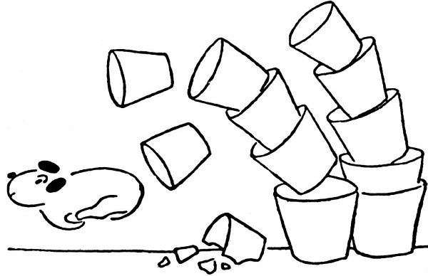  

V zahradě

A pak, abych řekl pravdu, ono takové štěně nemá ve svých pohybech ještě tu pravou míru. Chce udělat krůček, a zatím ji to vymrští jako z praku; chce skočit, a místo toho sebou mrskne, jako by ji vystřelil. Víte, mládí rádo tak trochu přepíná. Dášeňka vlastně neběží: ono to běží samo; a neskáče: ono jí to hází. Její rychlost je rekordní: za tři vteřiny stačí porazit hromadu květináčů, spadnout po hlavě do pařeniště na semenáčky kaktusů a přitom ještě třiašedesátkrát zavrtět ocáskem. Ať to někdo zkusí po ní!

  

Kouše si ocásek / kouše si nohu

2\. _Hryzat_, to je také to hlavní, co má Dášeňka na práci. Rozkouše jednoduše všechno, nač přijde, zejména proutěný nábytek, smetáky, koberce, anténu, střevíce, štětku na holení, fotografické potřeby, škatulky sirek, provázky, květiny, mýdlo, šaty a zejména knoflíky; nemá-li nic z toho po ruce, kouše v nářek. Má nesmírnou vytrvalost v hryzání: sežrala roh koberce a lem běhounu; račte uznat, že to je na takové zvířátko slušný výkon. Za krátkou dobu svého působení se zdarem rozžvýkala:

1 garnituru proutěného nábytku     Kč 360,–

1 povlak na pohovce     Kč 536,–

1 koberec starý     Kč 700,–

1 běhoun zánovní     Kč 940,–

1 hadici zahradní     Kč 136,–

1 kartáč     Kč 16,–

1 pár sandálů     Kč 19,–

1 pár střevíců domácích     Kč 29,–

různé     Kč 263,–

\---------------------------

Úhrnem     Kč 2999,–

(Račte laskavě přepočítat.)

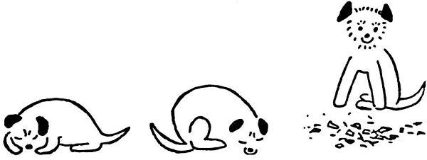  

Tichá hra

Z toho plyne, že takové čistokrevné štěně hrubosrstého foxteriéra má pro bratra cenu 2999 Kč. Rád bych věděl, nač podle toho přijde čistokrevné štěně řekněme lva berberského.

Někdy se udělalo v domě takové zvláštní ticho, Dášeňka byla někde v koutě tichá jako pěna; chválabohu, oddychl si člověk, to psisko mizerné tam nejspíš usnulo, dá aspoň na chvíli pokoj. Za nějaký čásek je to ticho už drobet podezřelé; člověku to nedá a jde se podívat, cože je Dášeňka tak dlouho klidná. Dášeňka se vítězně zvedá a vrtí ocáskem: pod ní jsou cucky a třísky něčeho, na čem se už nedá poznat, co to vlastně bylo. Myslím, že to byl kartáč.

3\. Neméně důležité jsou jiné sporty, například _přetahování_. V tom jí obyčejně musí pomáhat maminka Iris; a protože pejskové nemívají k použití lano, slouží jim k přetahování, co tak najdou: klobouk, punčocha, tkaničky střevíců a jiné užitečné předměty. To se rozumí, máma Dášeňku přetáhne a vleče ji po celé zahradě; ale Dášeňka nepovolí, zuby stisknuty, jen oči poulí a nechá se smýkat tak dlouho, až se dotyčné lano přetrhne. Není-li po ruce máma, lze pěstovat přetahování i bez ní, například s prádlem pověšeným k sušení, s fotografickým aparátem, s květinami, se sluchátkem telefonu, se záclonami nebo s anténou; ledacos se najde v člověčí boudě, na čem lze vyzkoušet sílu zubů i svalů, vytrvalost a sportovního ducha.

  

Přetahování

4\. Řeckořímsko-psí _zápas_ je další, a pokud se Dášeňky týče, také nejoblíbenější cvik těžké atletiky. To se obyčejně Dášeňka vrhne s nádhernou bojovností na mámu a zakousne se jí do nosu, do ucha nebo do ocásku; máma setřese odpůrce a popadne ho za krk; nastává takzvaný infighting[^2], to jest, oba borci se kutálejí v ringu (zpravidla na trávníku) a není vidět nic než neobyčejné množství předních i zadních nohou zmítajících se v chumlu chlupů, někdy to zakvikne, někdy z toho vítězně mávne ocásek, oba zápasníci divoce vrčí a dorážejí na sebe všemi čtyřmi, načež Iris vyskočí a oběhne třikrát celou zahradu, pronásledována bojovnou Dášeňkou; pak to začne znovu. To se rozumí, máma předvádí exhibiční zápas, nekouše doopravdy; ale Dášeňka v zápalu boje rve, trhá a kouše maminku, co jen síly má. Chudák Iris nechá v každém zápase nejeden chlup; čím víc roste, sílí a ježatí Dášeňka, tím je máma rozedranější a vypelichanější. Inu, s dětmi je kříž, to vám dosvědčí vaše maminka.

  

Zápas s maminkou

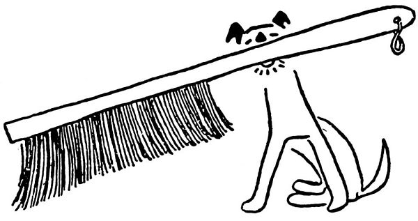  

Boj se smetákem

Někdy už chce mít máma pokoj a uklidí se někam před svou nadějnou dcerou; tu tedy se Dášeňka potýká se smetákem, svádí rozhořčený boj s nějakým hadrem nebo podniká neohrožené výpady na lidské nohy. Přijde návštěva, a Dášeňka se jí bleskurychle vrhne na kalhoty a rve je. Návštěva se nuceně usmívá, myslí si „Jdeš, neřáde“, ale ujišťuje, že má moc ráda pejsky, hlavně když se jí pověsí na nohavice. Nebo se Dášeňka takovému hostu vrhne na střevíce a tahá z nich tkanice; umí je rozvázat nebo utrhnout, než ten pán řekne pět (například „Pro pět ran“), a má z toho ukrutnou psinu (ne ten pán, ale Dášeňka).

  

Útok na střevíce / útok na nohavice

  

Rytmika (drbání)

5\. Vedle toho Dášeňka se zálibou provozuje _rytmiku a cvičení prostná_ (například drbání zadní nohou za uchem nebo pod bradou nebo zakusování domnělé blechy ve vlastním kožiše, kterýžto cvik slouží k pěstění grácie, ohebnosti a vůbec přízemní akrobacie).

Nebo někde v záhonku květin pěstuje trénink v zákopnictví; jelikož je z rodu teriérů čili myšařů, učí se vyhrabávat ze země myšičku. Musel jsem ji občas vytáhnout za ocásek z díry, kterou vyhrabala; ji to zřejmě baví, ale mne ne – prosím vás, čouhá-li člověku ze záhonku místo kvetoucí lilie jenom psí ocásek, je to trochu, abych tak řekl, pro zlost. Mně se, Dášeňko, zdá, že to už s tebou nepůjde; nic platno, budeš muset jít z domu. Ba, povídá maminka Iris moudrýma očima, ono to už s tou holkou nepůjde. Koukej, člověče, jak od ní vypadám celá oškubaná a umolousaná; nejvyšší čas, aby mi narostly nové šatičky. A pak, heleď: já už tu sloužím pět let – jednomu je přece jen líto, když se každý mazlí jen s tou nezbedou a mne si skoro nevšimne. Abys věděl, ani se nenažeru – ona si sežere své, a ještě jde do mé misky. Žádný vděk, pane. Už je načase, aby to děvče šlo někam do služby.

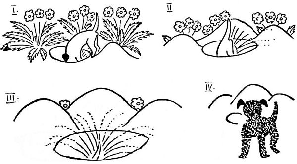  

Učí se hrabat

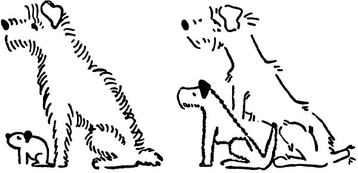  

Na začátku / na konci

A tak nadešel den, kdy si pro Dášeňku přišli cizí lidé a odnesli si ji v aktovce za našeho horlivého a blahovolného ujišťování, jaké je to znamenité a hodné štěňátko (toho dne rozbila ještě okna v pařeništi a vyrvala ze země celý záhonek mečíků), jak je způsobná a mírná a vůbec, takového druhého štěněte už není. Tak spánembohem, Dášeňko, a dělej dobrotu.

V domě je blahodárné ticho; chválabohu, teď už se nemusí člověk pořád děsit, jakou škodu či neplechu to zatrápené psisko kde ztropí. Zaplať pánbůh, že je pryč. – Ale ono je najednou až mrtvo v domě. Nu, co to? Lidé se sobě vyhýbají, aby se nemuseli dívat navzájem do očí; člověk se ohlíží po všech koutech, a ono nikde nic, nikde loužičky –

V psí boudě mlčky, jen mrkáním, pláče oškubaná a utahaná maminka Iris.

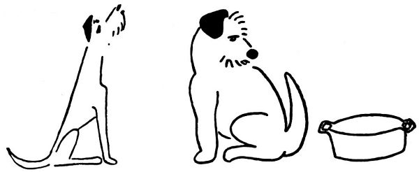  

Před jídlem / po jídle

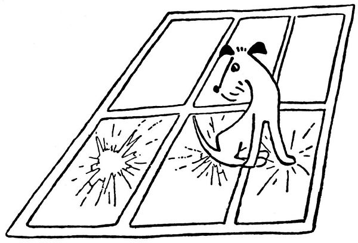  

Na pařeništi

</section>

[^1]: Bis, repete a da capo (ital.) – v hudebním názvosloví dvakrát, opakuj od začátku. _Pozn. red._

[^2]: Infighting (angl.) – boj zblízka (např. v boxu). _Pozn. red._

[^3]: Gagát – tmavý minerál, drahý kámen; dříve zaměňovaný s jantarem. _Pozn. red._
