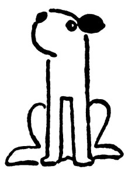

Počkej, Dášeňko, dnes tě budu fotografovat, jak sedíš moudře a způsobně na zápraží.

Tak jednou ti byl jeden foxteriér, Alík se jmenoval; byl pěkně bílý, uši měl krásně hnědé a na zádech nádhernou černou skvrnu jako dečku. A ten Alík žil v krásné zahradě, plné květin, motýlů a myšiček, a byla tam nádržka s bílými a růžovými lekníny, ale ten Alík do ní nikdy nespadl, protože nebyl takový blázen a třeštidlo jako někdo.

Jednou byl horký den a schylovalo se k bouři a dešti; a protože, vímeť, všichni psi před deštěm žerou trávu, žral trávu i Alík. A co se nestalo: v té trávě bylo jedno stébélko trávy čarovné, která se latinsky jmenuje Miraculosa magica, a ten Alík, nevěda o tom, to stébélko rozkousal a sežral. V ten okamžik se Alík změnil v překrásného bílého prince s hnědými lokýnkami a nádhernou černou skvrnou na zádech. V první chvíli neměl Alík tušení, že už není pejsek, ale že je zaklet do prince, a chtěl se ještě podrbat zadní nohou za uchem; teprve při tom shledal, že má na nohou zlaté střevíce – Ale tak počkej, Dášo!

(Zde, na nejnapínavějším místě, Dášeňka přestala poslouchat a rozběhla se za vrabcem. Následkem toho pohádka o Alíkovi nemohla být dopověděna a nemá konec.)

