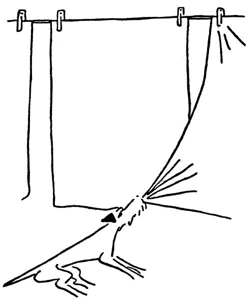

<section>

Nic platno, Dášo, už brzo budeš muset jít mezi jiné lidi a budeš patřit do jiné smečky. Tak já ti něco povím o lidech.

Podle tvrzení některých zvířat je člověk zlý, i mnozí lidé to říkají; ale nevěř tomu. Kdyby byl člověk zlý a necitelný, vy pejskové byste se k němu nepřidali a podnes byste žili divoce ve stepích. Ale z toho, že s ním kamarádíte, je vidět, že vás už před tisíci lety hladil a škrabal za uchem a krmil.

Lidí je několikero druhů. Jedni jsou velcí, štěkají hlubokým hlasem jako ohaři a mívají fousy. Říká se jim tatínkové. Těch se drž, protože ti vedou lidskou smečku, a proto tak trochu pouštějí hrůzu. Když budeš dělat dobrotu, neublíží ti ani za mák, naopak tě podrbou za uchem. To ty máš ráda, viď?

Druhý druh lidí je o něco menší, štěká tenkým hlasem a má čumáček hladký a holý. To jsou maminky, a těch se, Dášeňko, drž, protože ty tě nakrmí a někdy ti vyčešou kožíšek a vůbec se budou o tebe starat a hladit tě a nedají ti ublížit. Jejich přední tlapky, to ti je samá dobrota.

Třetí druh lidí je maličký, trochu větší než ty, a piští a kvičí jako štěňata. To jsou děti, a těch se drž. Děti slouží k tomu, aby si s tebou hrály a tahaly tě za ocásek a honily se s tebou po prérii a vůbec aby byla nějaká psina. Jak vidíš, je to v lidské smečce správně zařízeno.

Někdy si budeš hrát na ulici s pejsky a bude ti s nimi dobře a veselo, protože je to tvá krev a tvůj rod; ale doma, Dášo, doma se budeš cítit jen mezi lidmi. S těmi tě pojí něco divnějšího a jemnějšího nežli krev. To něco je důvěra a láska.

Tak běž.

</section>

[^1]: Bis, repete a da capo (ital.) – v hudebním názvosloví dvakrát, opakuj od začátku. _Pozn. red._

[^2]: Infighting (angl.) – boj zblízka (např. v boxu). _Pozn. red._

[^3]: Gagát – tmavý minerál, drahý kámen; dříve zaměňovaný s jantarem. _Pozn. red._

<section>

</section>

[^1]: Bis, repete a da capo (ital.) – v hudebním názvosloví dvakrát, opakuj od začátku. _Pozn. red._

[^2]: Infighting (angl.) – boj zblízka (např. v boxu). _Pozn. red._

[^3]: Gagát – tmavý minerál, drahý kámen; dříve zaměňovaný s jantarem. _Pozn. red._
